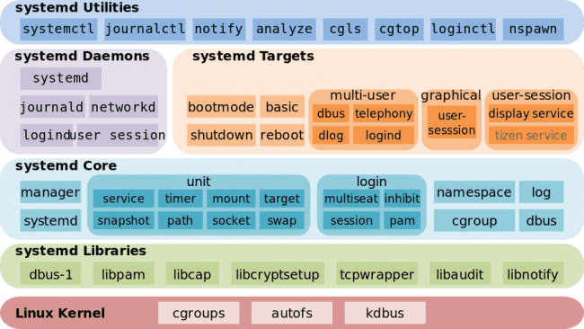

# Linux (Ubuntu) Notes

Taking notes of intersting stuff that I learn and summary of solutions to different problems I encounter. 

**Markdown cheatsheet:** [here](https://github.com/adam-p/markdown-here/wiki/Markdown-Cheatsheet#code) 

---
<br/>

##  NVIDIA, CUDA, CUDNN, and TensorFlow:

* https://stackoverflow.com/questions/41402409/tensorflow-doesnt-seem-to-see-my-gpu
* https://medium.com/@exesse/cuda-10-1-installation-on-ubuntu-18-04-lts-d04f89287130

* `nvidia-smi`

* cleaning up before new installation

```bash
sudo apt remove --auto-remove nvidia*
sudo apt remove --auto-remove cuda*
sudo apt purge nvidia*
sudo apt pruge cuda*
```
* Add the repository if not added 

```bash
sudo apt update
sudo add-apt-repository ppa:graphics-drivers/ppa
sudo apt-key adv --fetch-keys  http://developer.download.nvidia.com/compute/cuda/repos/ubuntu1804/x86_64/7fa2af80.pub

sudo bash -c 'echo "deb http://developer.download.nvidia.com/compute/cuda/repos/ubuntu1804/x86_64 /" > /etc/apt/sources.list.d/cuda.list'

sudo bash -c 'echo "deb http://developer.download.nvidia.com/compute/machine-learning/repos/ubuntu1804/x86_64 /" > /etc/apt/sources.list.d/cuda_learn.list'
```

* install the cuda: 

```bash
sudo apt update
sudo apt install cuda-10-1
sudo apt install libcudnn7
```

* download the CUDNN zip and extract it and copy the CUDNN header and libs to the CUDA folder: 

```bash
cp cudnn_extract_dir/include/cudnn.h /usr/local/cuda/include/
cp cudnn_extract_dir/lib64/* /usr/local/cuda/lib64/
```
* add paths for cuda (to `.bashrc`) (I think there is no need for specific paths for the cuda version e.g. `/usr/local/cuda-10.0/lib64`. Simply `/usr/local/cuda/lib64` and `/usr/local/cuda/include/`, and `/usr/local/cuda/bin/` would be enough.)
```
export PATH=/usr/local/cuda/include:/usr/local/cuda:/usr/local/cuda/bin:/usr/local/cuda-10.1/bin:${PATH:+:${PATH}}
export LD_LIBRARY_PATH=/usr/local/cuda/lib64:/usr/local/cuda-10.0/lib64:$LD_LIBRARY_PATH

```
* check that everything is ok: 
```
$ nvidia-smi 
$ nvcc --version
```

* install Tensorflow: `pip install tensorflow==<the version you want>`

* check that TF sees the GPU: in Python console: 

```python 
import tensorflow as tf 
tf.test.is_gpu_available()
sess = tf.Session(config=tf.ConfigProto(log_device_placement=True))
```


* **Useful commands for troubleshooting:**

```
ubuntu-drivers

```

---
<br/>

## Synaptic Touchpad
To check if the Kernel sees the device do: 

```
cat /proc/bus/input/devices
```
One should see a touchpad device, like:

```
I: Bus=0011 Vendor=0002 Product=0007 Version=01b1
N: Name="SynPS/2 Synaptics TouchPad"
P: Phys=isa0060/serio2/input0
S: Sysfs=/devices/platform/i8042/serio2/input/input8
U: Uniq=
H: Handlers=mouse2 event8
B: EV=b
B: KEY=420 0 70000 0 0 0 0 0 0 0 0
B: ABS=11000003 
```


To list all devices controlled with `xinput` do

```
xinput --list
```

This gives your the device Id of the touchpad. To see all the properties of the device do
 
```
xinput --list-props <device-id>
```
This gives you the ID of the property you want to set. In case of drag lock it is 330 To set the drag lock do
 
```
xinput set-int-prop <device> <property> <format (8, 16, 32)> <val> [<val> ...]
xinput set-int-prop 12 334 8 1
```

#### Making the options persistent: 

To make the options persistent, change the `/usr/share/X11/xorg.conf.d/40-libinput.conf` file, and add the corresponding options to the following section: 

```
#### == ATTENTION == Both option name and the value must be in quotation marks. 
Section "InputClass"
        Identifier "libinput touchpad catchall"
        MatchIsTouchpad "on"
        MatchDevicePath "/dev/input/event*"
        Driver "libinput"
        
        Option "TappingDragLock" "1"
EndSection
```

To see what options are available, you can do a `xinput --list-props <device-id>` or check the manual pages of `libinput` (the driver for the touch pad): [http://manpages.ubuntu.com/manpages/bionic/man4/libinput.4.html](http://manpages.ubuntu.com/manpages/bionic/man4/libinput.4.html)  

##### Alternative: 
add the configuration lines (e.g. `xinput set-int-prop 12 334 8 1`) to your `~/.xsessionrc`. If the file does not exist create it. 

---
<br />

## APT and `apt`
* APT: Advanced Packaging Tool

* `dpkg` 

* `apt`, `apt-get`, `apt-cache`
	* `apt install`, `apt remove --auto-remove`, `apt purge`, `apt search`, `apt show`
	* `/etc/apt/sources.list`, `/etc/apt/sources.list.d/`
		* `deb http://de.archive.ubuntu.com/ubuntu/ bionic main restricted`

* main, restricted, universe, multiverse

* `dpkg -l` lists all the installed packages and  `dpkg -l | grep <package_name>` for if a package is installed. 
* `apt list <package_name>` if a package is installed shows also an `[installed]` at the end. 


---
<br />

## X Window System, X.Org Server

* XFree86
* X11 == X Window System; The X protocol has been at version 11 (hence "X11") since September 1987
* X.Org System: the reference implementation of X11
* X is an architecture-independent system for remote graphical user interfaces and input device capabilities. Each person using a networked terminal has the ability to interact with the display with any type of user input device.
* Unlike most earlier display protocols, X was specifically designed to be used over network connections rather than on an integral or attached display device. X features network transparency, which means an X program running on a computer somewhere on a network (such as the Internet) can display its user interface on an X server running on some other computer on the network. The X server is typically the provider of graphics resources and keyboard/mouse events to X clients, meaning that the X server is usually running on the computer in front of a human user, while the X client applications run anywhere on the network and communicate with the user's computer to request the rendering of graphics content and receive events from input devices including keyboards and mice.
* The fact that the term "server" is applied to the software in front of the user is often surprising to users accustomed to their programs being clients to services on remote computers. Here, rather than a remote database being the resource for a local app, the user's graphic display and input devices become resources made available by the local X server to both local and remotely hosted X client programs who need to share the user's graphics and input devices to communicate with the user.

* Wayland
* Windowing System, Window Manager, Display Server, Compositing window manager

* By default, mtrack’s xorg configuration file gets placed in /usr/shared/X11/xorg.conf.d/50-mtrack.conf, which in my case meant its precedence was lower than both synaptics (placed in /etc/X11/xorg.conf.d, which takes precedence over the /usr/shared/X11/xorg.conf.d directory) and libinput (which initially had an alphanumerically lower file name (40-libinput.conf) than 50-mtrack.conf. (read here: [https://bill.harding.blog/2017/12/27/toward-a-linux-touchpad-as-smooth-as-macbook-pro/])(https://bill.harding.blog/2017/12/27/toward-a-linux-touchpad-as-smooth-as-macbook-pro/)). The configuration files are numbered to impose a sequence on them, e.g. do this one first, then this one, ...See `man run-parts` for more information. (read on askubuntu.com)

* [http://manpages.ubuntu.com/manpages/bionic/man4/libinput.4.html](http://manpages.ubuntu.com/manpages/bionic/man4/libinput.4.html)

* [http://manpages.ubuntu.com/manpages/bionic/man1/Xorg.1.html](http://manpages.ubuntu.com/manpages/bionic/man1/Xorg.1.html) 

* [http://manpages.ubuntu.com/manpages/bionic/man5/xorg.conf.5.html](http://manpages.ubuntu.com/manpages/bionic/man5/xorg.conf.5.html) 

* `/var/log/Xorg.0.log`

---
<br />

## Virtual Terminal (VT) == Virtual Console (VC)

* [https://en.wikipedia.org/wiki/Virtual_console](https://en.wikipedia.org/wiki/Virtual_console)
* In the Linux console and other platforms, usually the first six virtual consoles provide a text terminal with a login prompt to a Unix shell. The graphical X Window System starts in the _seventh_ virtual console. In Linux, the user switches between them by pressing the Alt key combined with a function key – for example Alt + F1 to access the virtual console number 1. Alt + ← changes to the previous virtual console and Alt + → to the next virtual console. To switch from the X Window System or a Wayland compositor, `Ctrl + Alt + F1` works. 

----
<br />

## Ubuntu Snaps
* `snap list`     ;      `snap info <snap_name>`
* Interfaces, Plugs, Slots: `snap connections <snap_name>`
* `snapcraft.yaml`
* Confinements: `strict`, `devmoe`, `classic` [https://snapcraft.io/docs/snap-confinement](https://snapcraft.io/docs/snap-confinement)
* [https://hackernoon.com/managing-ubuntu-snaps-the-stuff-no-one-tells-you-625dfbe4b26c](https://hackernoon.com/managing-ubuntu-snaps-the-stuff-no-one-tells-you-625dfbe4b26c)

----
<br />

## Printer and Scanner (Brother DCP 7055w)

* The primary mechanism for Ubuntu printing and print services is the **Common UNIX Printing System** (**CUPS**). [https://en.wikipedia.org/wiki/CUPS](https://en.wikipedia.org/wiki/CUPS) -- [https://help.ubuntu.com/lts/serverguide/cups.html](https://help.ubuntu.com/lts/serverguide/cups.html)

* `lpstat -W "all" -t` 
	* `lpstat` shows information about printers. The option `-W "all"` shows all the jobs (completed and not-completed). The option `-t` shows all the printer information. See tha man page of lpstat. 
	
* `lpq`: shows printer queue status

* To start the CUPS service. Then go to `localhost:631`. **Attention:** does not work well with Chrome (does not asks for admin password). Use Firefox instead. 

```
sudo systemctl enable cups
sudo systemctl start cups
```

#### Scanner: 
* [https://help.ubuntu.com/community/Scanners](https://help.ubuntu.com/community/Scanners) /// [https://help.ubuntu.com/community/sane](https://help.ubuntu.com/community/sane)

* This is actually specific to my Brother DCP7055w Printer and Scanner. After installing the driver (using the provided shell script form Brother website. It could also be done by installing the .deb pacakages), I had to add scanner using `brsaneconfig4 -a name=<some name you like> model=<some model, not important> ip=<ip address of the printer>`. To find the IP address of the printer I had to use `avahi-browse --all -t -r` to find the mDNS cached IP address. Becuase the printer had a URI (Bonjoure?) instead of IP address. See [https://askubuntu.com/questions/395926/brother-dcp-7055w](https://askubuntu.com/questions/395926/brother-dcp-7055w) and [https://askubuntu.com/questions/643584/how-do-i-get-ip-of-installed-network-printer](https://askubuntu.com/questions/643584/how-do-i-get-ip-of-installed-network-printer). 


----
<br />

## Seeing information about active processes

* `ps`: displays information about a selection of the active processes.  
* `top`: repetitive update of the selection and the displayed information.
* `ps aux`: display all processes in user friendly format. Option `a`: Lift the BSD-style "only yourself" restriction. Option `u`: Display user-oriented format. Option `x`:  Lift the BSD-style "must have a tty" restriction. These options are in BSD style (without `-`). See the man page. 
* `ps aux | grep T`: show terminated processes; `ps aux | grep Z` show zombie prcesses (defunct ("zombie") process, terminated but not reaped by its parent). 

* `lsof`: Seeing the list of open files and the processes that are using them. This is really handy, since I think many things (e.g. devices) are implemented as files. So for example to see the list of all processes that are using the NVIDIA GPU, you can do: `lsof /dev/nvidia* `


----
<br />

## `vim`

#### Difference `vi` and `vim`
Functionally, **vim** is almost a proper superset of **vi**. Therefore, everything that is in vi is available in vim.

Vim adds onto those features. Here are a some of the extended vim features:

 - Vim has been ported to a much wider range of OS's than vi.
 - Vim includes support (syntax highlighting, code folding, etc) for several popular programming languages (C/C++, Python, Perl, shell, etc).
 - Vim integrates with cscope.
 - Vim can be used to edit files using network protocols like SSH and HTTP.
 - Vim includes multilevel undo/redo.
 - Vim allows the screen to be split for editing multiple files.
 - Vim can edit files inside a compressed archive (gzip, zip, tar, etc).
 - Vim includes a built in diff for comparing files (vimdiff).
 - Vim includes support for plugins, and finer control over config and startup files.
 - Vim can be scripted with vimscript, or with an external scripting language (e.g. python, perl, shell).

There are many more differences. Refer below sources which are few of good places to start finding out more.

**Source:** [**Vim.Org**][http://www.vim.org], [**Vim on Wikpedia**][ http://en.wikipedia.org/wiki/Vim_%28text_editor%29].

take from here: [https://askubuntu.com/a/418413/229740](https://askubuntu.com/a/418413/229740)

---

* https://askubuntu.com/questions/104138/what-features-does-vim-tiny-have

https://askubuntu.com/questions/104138/what-features-does-vim-tiny-have/104202#104202

https://askubuntu.com/questions/104138/what-features-does-vim-tiny-have

https://stackoverflow.com/questions/1218390/what-is-your-most-productive-shortcut-with-vim


----
<br />

## SSH for Github

You need to create an SSH key pair, and then add your public key to your Github account. Then you can use `git@githbu.com:zardosht/repo_name.git` URL to push and pull. 

No need to enter username and password. 

The keys have by default the name `id_rsa` for private key and `id_rsa.pub` for the public key. If you have multiple key pairs, you need to name them accordingly. 

**Listing the key pairs** 
```
$ ls -al ~/.ssh/
```


**Generating new key pair and add it to the `ssh-agent`**

```
$ ssh-keygen -t rsa -b 4096 -C "zhodaie@gmail.com"
```
The `-C` option is for setting the comment (but I think it some how also associates your key to your Github account)

Then enter the name for the key, and the pass phrase used to encrypt. You need this pass phrase any time you use the key, unless you add the to the SSH agent. 

**Add the private key to `ssh-agent`**
So that you don't have to type the pass phrase everytime you use the key.

```
$ eval "$(ssh-agent -s)"
> Agent pid 59566

$ ssh-add ~/.ssh/<key name, e.g. github_id_rsa>
```

*From the `man` page*: `ssh-agent` is a program to hold private keys used for public key authentication (RSA, DSA, ECDSA, Ed25519).  `ssh-agent` is usually started in the beginning of an X-session or a login session, and all other windows or programs are started as clients to it. The agent initially does not have any private keys.  Keys are added using `ssh(1)` (see `AddKeysToAgent` in `ssh_config`(5) for details) or `ssh-add(1)`.  Multiple identities may be stored in `ssh-agent` concurrently and `ssh`(1) will automatically use them if present.  `ssh-add(1)` is also used to remove keys from `ssh-agent` and to query the keys that are held in one.

See the note about how SSH selects a key when logging in (it actually does not select any, in searches all the keys [https://superuser.com/questions/1067419/how-does-ssh-choose-the-correct-key-to-use](https://superuser.com/questions/1067419/how-does-ssh-choose-the-correct-key-to-use)). 

**Add the SSH public key to your Github account**
```
$ sudo apt-get install xclip
# Downloads and installs xclip. If you don't have `apt-get`, you might need to use another installer (like `yum`)

$ xclip -sel clip < ~/.ssh/id_rsa.pub
# Copies the contents of the id_rsa.pub file to your clipboard
```
then go to your `Github profile settings > SSH and GPG keys`, add a new SSH key and paste the copied public key and save the settings. 


**Test the connection** 

```
$ ssh -T git@github.com
# Attempts to ssh to GitHub

```

You see the warining: 

```
> The authenticity of host 'github.com (IP ADDRESS)' can't be established.
> RSA key fingerprint is 16:27:ac:a5:76:28:2d:36:63:1b:56:4d:eb:df:a6:48.
> Are you sure you want to continue connecting (yes/no)?
```
or 

```
> The authenticity of host 'github.com (IP ADDRESS)' can't be established.
> RSA key fingerprint is SHA256:nThbg6kXUpJWGl7E1IGOCspRomTxdCARLviKw6E5SY8.
> Are you sure you want to continue connecting (yes/no)?
```
Verify that the fingerprint you your message matches the above fingerprints and answer with `yes`. 

You will see: 
```
> Hi username! You've successfully authenticated, but GitHub does not
> provide shell access.
```

**Adding or changing a passphrase**
You can change the passphrase for an existing private key without regenerating the keypair by typing the following command:

```
$ ssh-keygen -p
# Start the SSH key creation process
> Enter file in which the key is (/Users/you/.ssh/id_rsa): [Hit enter]
> Key has comment '/Users/you/.ssh/id_rsa'
> Enter new passphrase (empty for no passphrase): [Type new passphrase]
> Enter same passphrase again: [One more time for luck]
> Your identification has been saved with the new passphrase.
```

If your key already has a passphrase, you will be prompted to enter it before you can change to a new passphrase.

----
<br />

## REISUB - magic SysRq key

https://en.wikipedia.org/wiki/Magic_SysRq_key

Magic SysRq key sequence for safely rebooting: 

`REISUB`: (to remember says the sequence)

* un**R**aw (take control of keyboard back from X),
* t**E**rminate (send SIGTERM to all processes, allowing them to terminate gracefully),
* k**I**ll (send SIGKILL to all processes except init, forcing them to terminate immediately),
* **S**ync (flush data to disk),
* **U**nmount (remount all filesystems read-only),
* re**B**oot.


Press `Alt+SysRq` or `Fn + Alt + SysRq` or `Print Screen` if you don't have `SysRq`. 

Hold `Alt`, and press different commands (see table below). 


| Action	| QWERTY  |
|---------------|---------|
| Set the console log level, which controls the types of kernel messages that are output to the console	| 0 - 9 |
| Immediately reboot the system, without unmounting or syncing filesystems  |	 b |
| Perform a system crash. A crashdump will be taken if it is configured.|	c |	
| Display all currently held Locks (CONFIG_LOCKDEP kernel option is required)|	d |
|Send the SIGTERM signal to all processes except init (PID 1) |	e |
|Call oom_kill, which kills a process to alleviate an OOM condition	| f |	
| When using Kernel Mode Setting, switch to the kernel's framebuffer console. <br />If the in-kernel debugger kdb is present, enter the debugger.	| g| 
|Output a terse help document to the console <br />Any key which is not bound to a command should also perform this action	| h	|
| Send the SIGKILL signal to all processes except init	| i |	
| Forcibly "Just thaw it" – filesystems frozen by the FIFREEZE ioctl. |	j |
| Kill all processes on the current virtual console (can kill X and SVGALib programs)<br /> This was originally designed to imitate a secure attention key	 | k	|
|Shows a stack backtrace for all active CPUs.	| l |
|Output current memory information to the console	m|
|Reset the nice level of all high-priority and real-time tasks	|n|
|Shut off the system	|o|
|Output the current registers and flags to the console	|p|
Display all active high-resolution timers and clock sources.	|q|
|Switch the keyboard from raw mode, used by programs such as X11 and SVGALib, to XLATE mode	|r|
|Sync all mounted filesystems	|s|
|Output a list of current tasks and their information to the console	|t|
|Remount all mounted filesystems in read-only mode	|u|
|Forcefully restores framebuffer console.<br />
For ARM processors, cause ETM buffer dump instead.	|v|
|Display list of blocked (D state) tasks	|w|
|Used by xmon interface on PowerPC platforms. Disables lockdown (Secure Boot restrictions) on some kernels.	|x|
|Show global CPU registers (SPARC-64 specific)	|y|
|Dump the ftrace buffer	|z|
|Print a summary of available magic SysRq keys	|space|	


----
<br />

## Prevent Apache from Starting at boot

Disable and stop: 
* `sudo systemctl disable apache2` 
* `sudo systemctl stop apache2`
  
Test:
  * `systemctl is-active apache2.service`, 
  * `systemctl is-enabled apache2.service `

----
<br />

## Networking 

* `ifconfig, ifup, ifdown` : for configuring and starting/stopping network interfaces
* `/etc/network/interfaces` : network interface configuration file (might not have all interfaces depending on if you have installed Network Manager)
* `network-manager, nmcli, nmtui` : the Network Manager (https://wiki.debian.org/NetworkManager). A program to make network configuration simpler
  * `/etc/NetworkManager/system-connections` : folder containing connection information/configuration for each network manager connection
  * the meaning of settings in `man nm-settings` : settings in configuration files
  * if changed a setting you man need to restart the nm deamon `sudo /etc/init.d/network-manager restart`
  * `nm-connection-editor` : can be used to edit netowork manager configuration
  * `/etc/NetworkManager/NetworkManager.conf` : contains network manager configs

* `nslookup`, `dig` : ns look-up utilitiies
* `systemd-resolve --status` : print status information system service for resolving names (DNS, services, ....)
  * `sudo systemctl status systemd-resolved.service`  : similar to the above
  * `resolvconf` manages nameserver information
  * `/etc/resolv.conf`(a symlink to one of the other files): `/run/systemd/resolve/resolv.conf` and `/run/resolvconf/resolv.conf`
  * also this file maybe interesting `/etc/systemd/resolved.conf `

If you have problems with the DNS resolutions for some hosts, do the following: 

(https://www.linode.com/community/questions/17081/dns-stops-resolving-on-ubuntu-1804, <br/>
https://askubuntu.com/questions/966870/dns-not-working-after-upgrade-17-04-to-17-10, <br/> 
https://wiki.archlinux.org/index.php/Systemd-resolved, <br/> 
https://en.wikipedia.org/wiki/Resolvconf, <br />
https://askubuntu.com/questions/1012641/dns-set-to-systemds-127-0-0-53-how-to-change-permanently, <br />
https://archive.fosdem.org/2019/schedule/event/dns_systemd_resolved/, <br />
https://wiki.archlinux.org/index.php/Systemd-networkd, <br />
)

```bash
$ sudo rm /etc/resolv.conf
$ sudo ln -s /run/resolvconf/resolv.conf /etc/resolv.conf
$ systemctl restart resolvconf
```

  


----
<br />

## SystemD

* `systemctl` : Control the systemd system and service manager
* `systemctl --all | grep -i --context=10 apache`
* `systemctl is-enabled apache2`
* `systemctl status <service-name>`

* `service`: runs a _System V_ init script.
  * `service --status-all`



One of the most fundamental distinctions in modern Linux systems is whether they use SystemV or Systemd. Here are the main differences between the two.

1. SystemV is older, and goes all the way back to original Unix.
2. SystemD is the new system that many distros are moving to.
3. SystemD was designed to provide faster booting, better dependency management, and much more.
4. SystemD handles startup processes through `.service` files.
5. SystemV handles startup processes through shell scripts in `/etc/init*`.

#### Indicators
If you’re starting and stopping things using `systemctl restart sshd`, etc, you’re on a SystemD system.

If you’re starting and stopping things using `/etc/init.d/sshd start`, etc, you’re on a SystemV system.


#### Which distros use which?
Many older versions of SystemD distros were SystemV.

Here’s an incomplete but hopefully useful breakdown of which distros are on which system.

* Systemd: Amazon Linux, Red Hat Enterprise, CentOS, Fedora, Debian/Ubuntu/Mint

* SystemV: Gentoo, Alpine, Slackware, Linux from Scratch

Notes
There are other startup systems as well, such as Upstart and BSD.

https://danielmiessler.com/study/the-difference-between-system-v-and-systemd/ <br />
https://en.wikipedia.org/wiki/Systemd <br /> 
https://en.wikipedia.org/wiki/UNIX_System_V <br />
https://www.freedesktop.org/wiki/Software/systemd/ <br />


----
<br />


----
<br />


----
<br />


----
<br />


----
<br />


----
<br />


----
<br />

